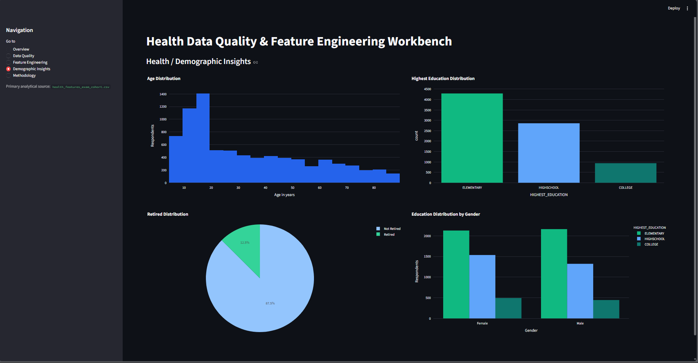

# Health Data Quality & Feature Engineering Workbench

## Overview

This project transforms real healthcare survey and examination data into analysis-ready features through reproducible loading, cohort construction, missing-value handling, feature engineering, data-quality validation, and dashboard reporting.

The repository is designed as a portfolio-ready example of practical healthcare data preparation and reporting rather than as a machine-learning or clinical-diagnosis project.

## Problem Statement

Downstream analysis becomes harder when healthcare datasets contain:

- missing age values in overlapping fields
- split education categories across respondent groups
- respondent coverage that differs by source file
- additional lineage tables that do not align cleanly with the examination cohort

Before any useful reporting can happen, those issues need to be resolved in a documented and reproducible way.

## What the Project Does

- reproducible health-data loading from tracked raw files
- cohort construction using `SEQN`
- missing-value handling with documented fallback rules
- feature engineering for age, education, and retirement reporting
- data-quality reporting for source and engineered fields
- Streamlit dashboard delivery
- methodology documentation
- automated validation and tests

## Source Data

The project uses four real source files:

- `DEMO_D.csv`
- `BPX_D.csv`
- `TCHOL_D.csv`
- `DEMO_RETIRED.CSV.xls`

`DEMO_RETIRED.CSV.xls` is preserved under its original filename for traceability, even though the file contents are CSV-formatted text.

## Population Lineage

```text
DEMO                         10,348
  -> inner join BPX
DEMO + BPX                   9,950
  -> inner join TCHOL
Analysis-ready exam cohort   8,086
```

The 8,086-row examination cohort is the primary analytical and dashboard population because it is the respondent set with the demographic, blood-pressure, and cholesterol data required for this workbench.

## Engineered Features

- `AGE_AT_SCREENING`
- `AGE_AT_EXAM`
- `HIGHEST_EDUCATION`
- `RETIRED`

Detailed transformation rules are documented in [docs/transformation_rules.md](docs/transformation_rules.md).

## Data Quality Results

Current analysis-ready results:

- `8,086` analysis-ready respondents
- `0` duplicate `SEQN`
- `AGE_AT_SCREENING`: `100%` complete
- `AGE_AT_EXAM`: `100%` complete
- `HIGHEST_EDUCATION`: `100%` complete
- `RETIRED`: `100%` complete
- overall engineered-feature completeness: `100%`

This does **not** mean every raw source field has zero missing values. The project explicitly preserves the distinction between raw-source completeness and engineered-feature completeness.

## Dashboard

The Streamlit application is titled:

**Health Data Quality & Feature Engineering Workbench**

Sections:

- Overview
- Data Quality
- Feature Engineering
- Demographic Insights
- Methodology

### Dashboard Preview



## Project Structure

```text
health-data-feature-engineering/
|-- dashboard/
|   `-- app.py
|-- data/
|   |-- raw/
|   `-- processed/
|-- docs/
|   |-- assumptions.md
|   |-- data_dictionary.md
|   |-- project_overview.md
|   `-- transformation_rules.md
|-- image/
|-- notebook/
|   `-- Data Science Challenge - Medical Examination.ipynb
|-- src/
|   |-- __init__.py
|   |-- data_loader.py
|   |-- data_quality.py
|   |-- feature_engineering.py
|   `-- pipeline.py
|-- tests/
|   `-- test_pipeline.py
|-- .gitignore
|-- README.md
`-- requirements.txt
```

## How to Run

```powershell
python -m venv .venv
.venv\Scripts\activate
pip install -r requirements.txt
python -m src.pipeline
streamlit run dashboard/app.py
```

Run tests with:

```powershell
pytest
```

## Generated Outputs

These outputs are generated locally by `python -m src.pipeline` and ignored by Git:

- `health_features_exam_cohort.csv`
- `health_features_notebook_equivalent.csv`
- `data_quality_report.csv`

## Tools

- Python
- Pandas
- NumPy
- Streamlit
- Plotly
- Matplotlib
- Seaborn
- Pytest

## Limitations

- `RIDAGEMN` fallback uses `RIDAGEYR x 12`, which is less precise than true month-level age.
- `AGE_AT_EXAM` uses a `+1 month` fallback inherited from the original notebook.
- Current education mapping is preserved from the notebook, including one exam-cohort `DMDEDUC3 = 99` record treated as `ELEMENTARY`.
- The notebook-equivalent outer merge is retained for lineage but is not the primary analytical population.
- This project supports data-quality and decision-support workflows; it is not a clinical diagnosis or predictive medicine tool.

## Why This Project Matters

This work demonstrates how to turn messy healthcare survey/examination data into:

- a reproducible analytical cohort
- documented transformation rules
- measurable data-quality improvements
- stakeholder-friendly reporting outputs
- a dashboard suitable for operational or project-support review

That is useful in healthcare analytics, reporting, governance, and IT/data project support contexts where traceability matters as much as the final metrics.

## Future Improvements

- configurable education and retirement mapping rules
- stronger schema validation around source files
- expanded data-quality rules and anomaly checks
- additional supported demographic and examination breakdowns
